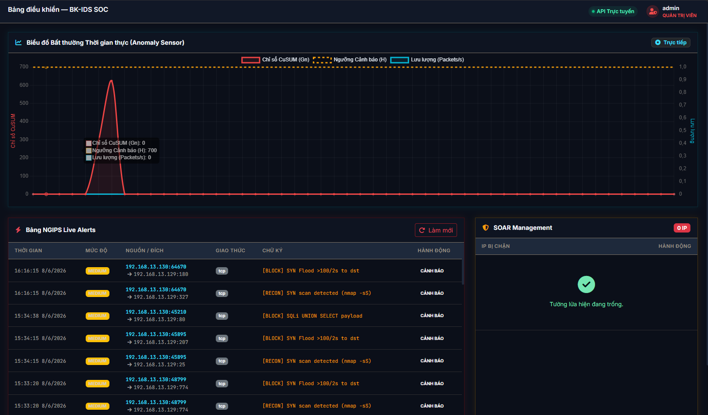
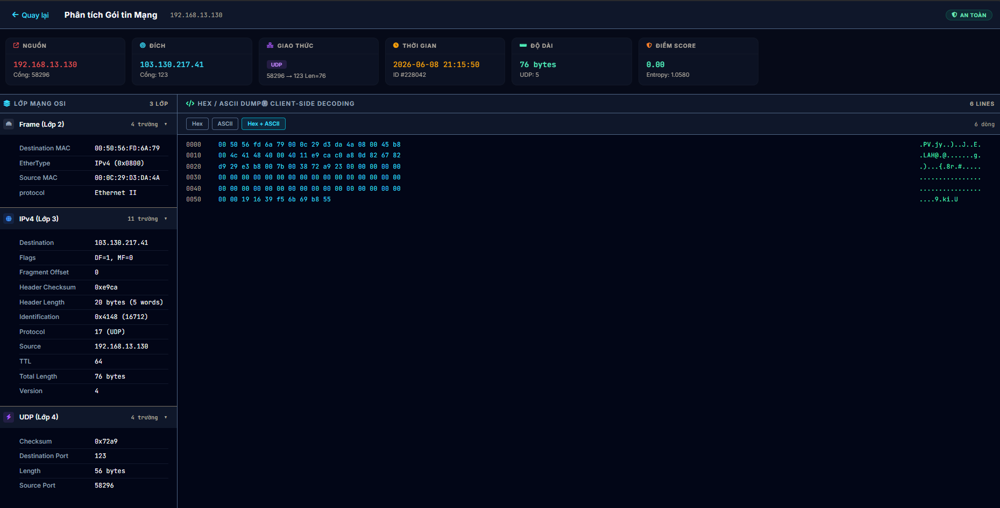
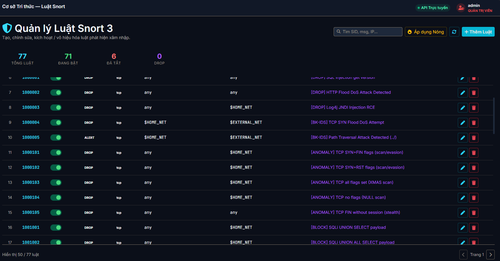

<h1 align="center">
  
  <br>
  BK-IDS: Next-Gen Intrusion Prevention System & SOC Dashboard
</h1>

<p align="center">
  <strong>Hệ thống Giám sát An ninh Mạng và Phản ứng Sự cố (SOAR) Tự động hóa</strong>
</p>

<p align="center">
  <a href="#-tổng-quan-overview">Tổng quan</a> •
  <a href="#-tính-năng-cốt-lõi-core-features">Tính năng</a> •
  <a href="#-giao-diện-hệ-thống-screenshots">Giao diện</a> •
  <a href="#-kiến-trúc-hệ-thống-architecture">Kiến trúc</a> •
  <a href="#-công-nghệ-sử-dụng-tech-stack">Công nghệ</a> •
  <a href="#-triển-khai-hệ-thống-deployment">Triển khai</a>
</p>

---

## 🛡️ Tổng quan (Overview)

**BK-IDS** là một hệ thống Phòng chống Xâm nhập Thế hệ mới (NGIPS) kết hợp cùng Bảng điều khiển Trung tâm Điều hành An ninh (SOC Dashboard). Được thiết kế theo kiến trúc Microservices linh hoạt, BK-IDS cung cấp khả năng phân tích lưu lượng mạng theo thời gian thực, kiểm tra gói tin chuyên sâu (DPI) và tự động hóa toàn bộ quá trình phản ứng sự cố (SOAR).

Dự án được xây dựng hướng tới khả năng xử lý tốc độ cao, trễ thấp thông qua việc can thiệp trực tiếp vào tầng Data Link (Layer 2) bằng công nghệ zero-copy, đồng thời tự động hóa các rào chắn tường lửa ở tầng Network (Layer 3) để chống lại các luồng tấn công độc hại ngay lập tức.

## ✨ Tính năng cốt lõi (Core Features)

- **Phân tích Lưu lượng Thời gian thực & DPI:** Bắt và phân tích gói tin trực tiếp ở chế độ zero-copy. Hỗ trợ bóc tách payload Base64 và hiển thị dưới dạng Hex Dump chuyên sâu (tương tự Wireshark) ngay trên giao diện web.
- **Phát hiện Tấn công Đa lớp (Signature & Anomaly):** Tích hợp engine Snort 3 mạnh mẽ để đối sánh các dấu hiệu tấn công đã biết (SQL Injection, XSS, DoS, Path Traversal, Malware) kết hợp cùng thuật toán phát hiện hành vi bất thường (CUSUM).
- **Tự động hóa Phản ứng (SOAR - Security Orchestration, Automation, and Response):** Ngay khi phát hiện lưu lượng mạng độc hại vượt ngưỡng an toàn, module SOAR sẽ gọi trực tiếp các lệnh tường lửa `iptables` để khóa vĩnh viễn IP tấn công chỉ trong vòng vài mili-giây.
- **Quản lý Luật thông minh (Rules Management):** Giao diện quản lý trực quan cho phép kỹ sư bảo mật thêm, sửa, xóa, và bật/tắt các luật Snort 3. Hệ thống tự động biên dịch (compile) và reload lõi phân tích mà không gây gián đoạn mạng.
- **Báo cáo & Giám sát Trực quan:** Dashboard cung cấp các biểu đồ thống kê chuyên sâu về lưu lượng truy cập, tình trạng tài nguyên hệ thống (CPU, RAM), và tự động phân loại cảnh báo theo mức độ rủi ro (Critical, High, Medium, Low).

## 📸 Giao diện Hệ thống (Screenshots)

> **Lưu ý:** Vui lòng thay thế đường dẫn ảnh `docs/images/...` bằng đường dẫn ảnh thực tế của dự án.

<p align="center">
  
  <br>
  <em>Giao diện Dashboard Giám sát Tổng quan (Tổng số cảnh báo, biểu đồ lưu lượng)</em>
</p>

<p align="center">
  
  <br>
  <em>Tính năng Deep Packet Inspection (DPI) bóc tách Hex Dump & Base64 Payload</em>
</p>

<p align="center">
  
  <br>
  <em>Trang Quản lý Luật Snort 3</em>
</p>

## 🏗️ Kiến trúc Hệ thống (Architecture)

Hệ thống hoạt động theo luồng dữ liệu 4 bước khép kín:
1. **Packet Capture:** `Snort 3` sử dụng `AF_PACKET` socket ở chế độ Promiscuous để lấy gói tin trực tiếp từ card mạng (ens33/eth0) mà không cần sao chép bộ nhớ (zero-copy), tối ưu CPU.
2. **Log Ingestion:** Tiến trình `Log Watchdog` (chạy ngầm) liên tục đọc file log JSON của Snort, chuẩn hóa dữ liệu, loại bỏ trùng lặp bằng thuật toán băm SHA-256 và lưu trữ vào cơ sở dữ liệu MySQL.
3. **SOAR Execution:** Trong quá trình xử lý log, nếu phát hiện cảnh báo thuộc mức độ nghiêm trọng cao, module SOAR sẽ lập tức chèn luật `DROP` vào các chain `PREROUTING`, `INPUT` và `DOCKER-USER` của iptables.
4. **API Gateway & UI:** `Flask API` xử lý các yêu cầu bảo mật có xác thực bằng JWT từ `Vue.js Frontend`, cung cấp dữ liệu qua kết nối RESTful HTTP.

## 💻 Công nghệ Sử dụng (Tech Stack)

### Lõi Phân tích Mạng (Core Engine)
- **Snort 3:** Engine lõi phân tích mạng tốc độ cao.
- **AF_PACKET (libdaq):** Module truy cập trực tiếp tầng Data Link (Layer 2) của Kernel Linux.
- **Iptables / Netfilter:** Tường lửa Kernel can thiệp truy cập ở tầng Network (Layer 3/4).

### Backend API Server
- **Python (Flask):** Xây dựng API Gateway chuẩn RESTful.
- **PyMySQL / SQLAlchemy:** Tương tác với cơ sở dữ liệu tốc độ cao.
- **JWT (JSON Web Tokens):** Bảo mật định danh và phân quyền (Role-Based Access Control).

### Frontend Dashboard
- **Vue.js 3:** Khung nhìn người dùng dạng SPA (Single Page Application), sử dụng Composition API.
- **Bootstrap 5 & Chart.js:** Xây dựng giao diện chuẩn SOC Dark Theme và các biểu đồ phân tích.
- **Nginx Alpine:** Web Server siêu nhẹ và Reverse Proxy Gateway điều hướng lưu lượng.

### Lưu trữ & Điều phối Cơ sở hạ tầng
- **MySQL 8.0:** Lưu trữ cảnh báo, cấu hình quản trị và lịch sử chặn IP.
- **Docker & Docker Compose:** Đóng gói và cô lập toàn bộ 7 dịch vụ (microservices) để dễ dàng triển khai.

## 🚀 Triển khai Hệ thống (Deployment)

Dự án được chứa trong Docker Compose giúp việc khởi tạo môi trường trở nên đồng nhất trên bất kỳ hệ điều hành Linux nào.

### Yêu cầu hệ thống:
- Hệ điều hành Linux (Ubuntu/Debian/Kali).
- Cài đặt sẵn Docker và Docker Compose.

### Các bước cài đặt:
```bash
# 1. Clone mã nguồn
git clone https://github.com/your-username/bk_ids.git
cd bk_ids

# 2. Khởi tạo biến môi trường từ template
cp .env.example .env
# (Sửa thông tin .env nếu cần cấu hình lại CSDL hoặc API Keys)

# 3. Khởi chạy toàn bộ hệ thống bằng Docker Compose
sudo docker-compose up -d --build

# 4. Kiểm tra trạng thái các container
sudo docker-compose ps
```

**Truy cập vào Dashboard:**
- Mở trình duyệt web và truy cập qua Nginx Portal Gateway: `http://<IP_ADDRESS>:9000/soc-admin/`
- Thông tin đăng nhập mặc định sẽ nằm trong tài liệu hướng dẫn bàn giao hoặc qua bảng `auth_users` được cấp phép.

## 📁 Cấu trúc Thư mục Chính

```text
/bk_ids/
├── web_dashboard/      # Mã nguồn Giao diện (Vue.js) và Backend (Flask API)
├── core_engine/        # Lõi hệ thống: Luật Snort (local.rules), Engine SOAR, Anomaly Sensor
├── portal_gateway/     # Cấu hình Nginx điều hướng traffic (Port 9000)
├── snort_config/       # Các file danh sách Blacklist/Whitelist và cấu hình Snort lua
├── mysql_init/         # Scripts khởi tạo cấu trúc cơ sở dữ liệu ban đầu
├── storage/            # Thư mục lưu trữ tĩnh cho tệp tin PCAP và thông tin xác thực
└── docker-compose.yml  # Bản thiết kế kiến trúc toàn bộ các container
```

---
*© 2026 Phát triển bởi Nhóm Nghiên cứu An toàn thông tin. Tài liệu nội bộ dự án BK-IDS.*